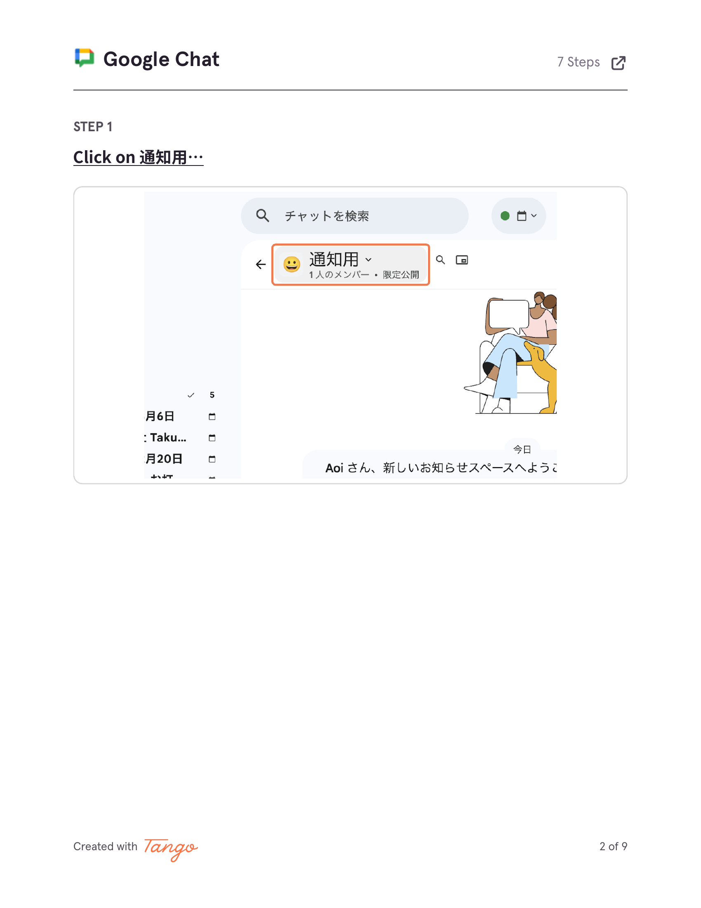
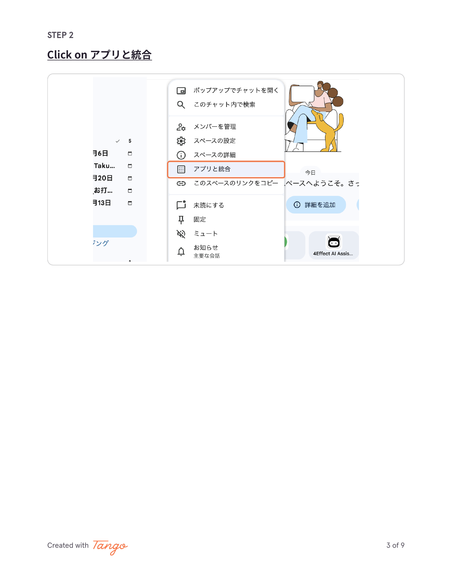
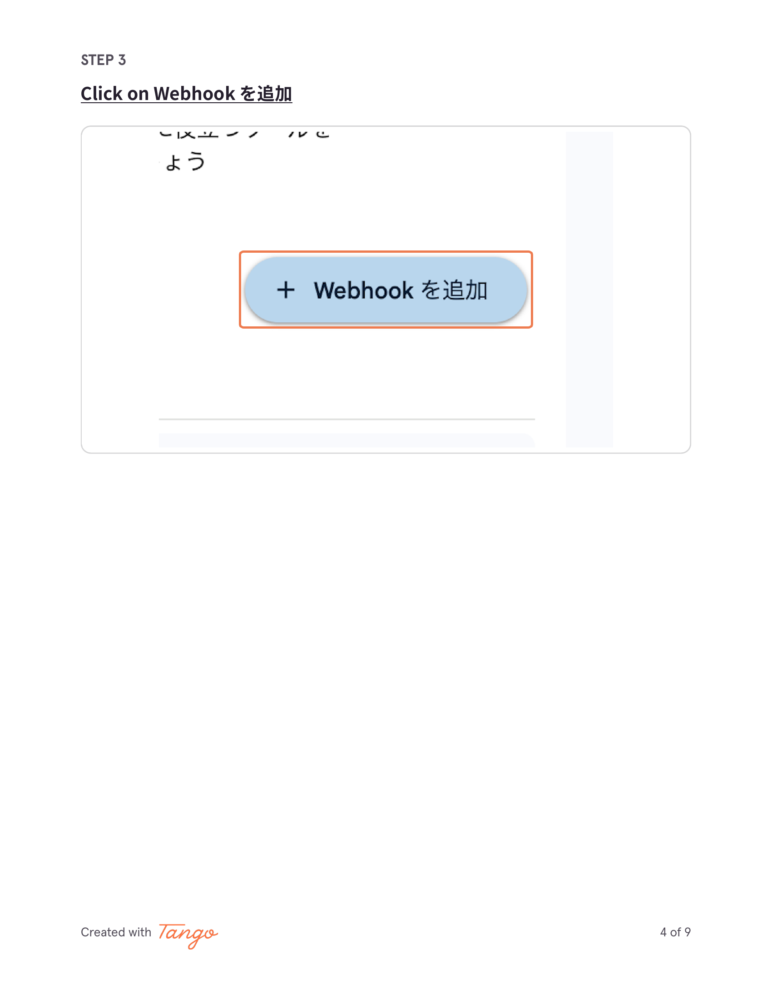
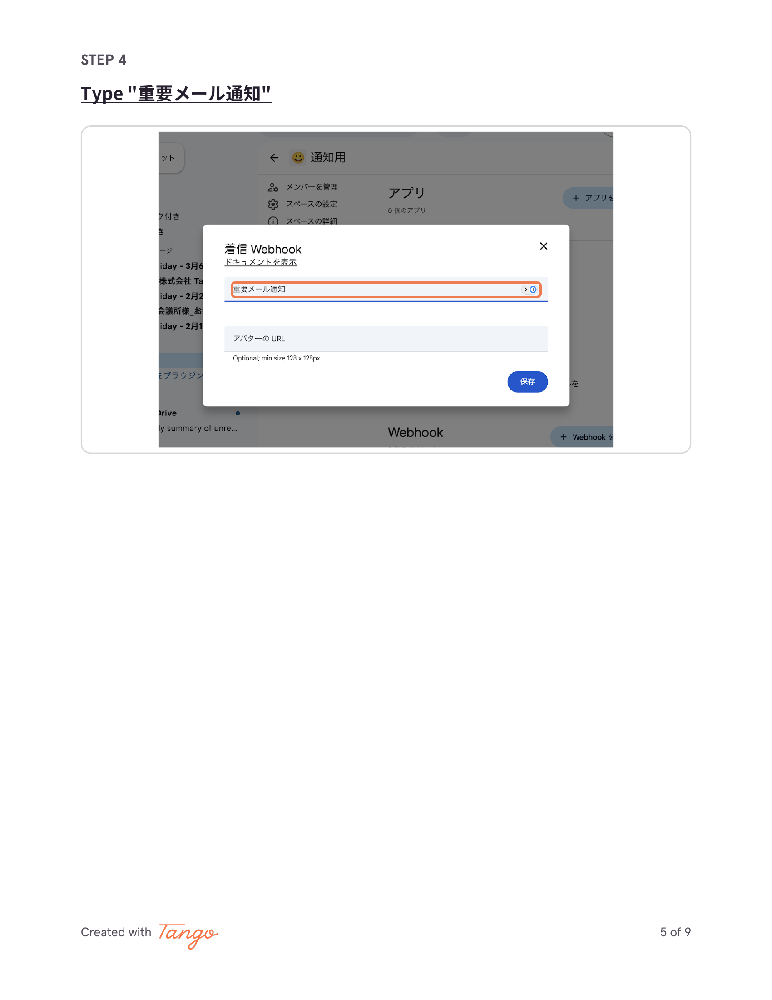
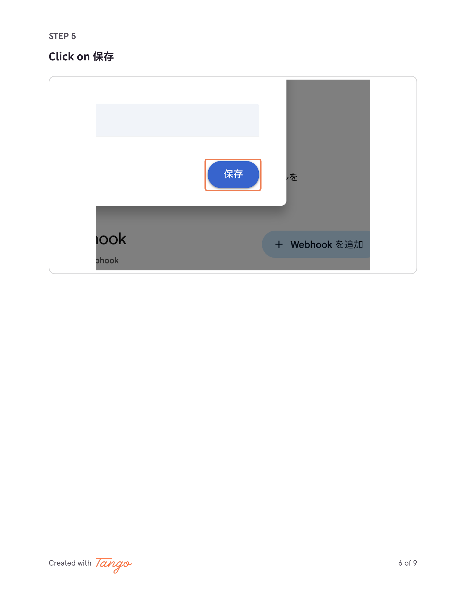
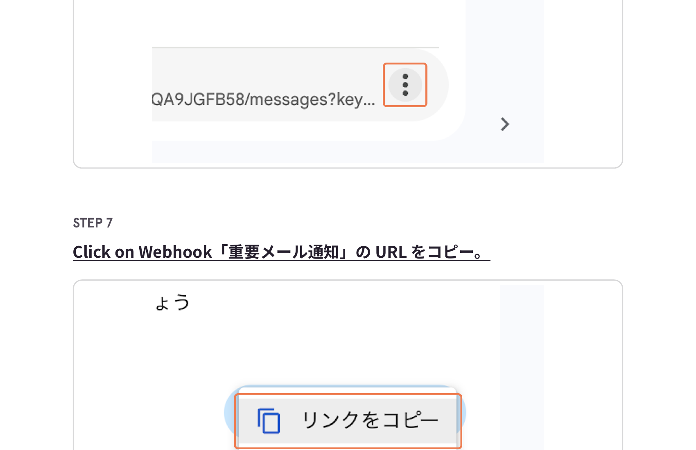
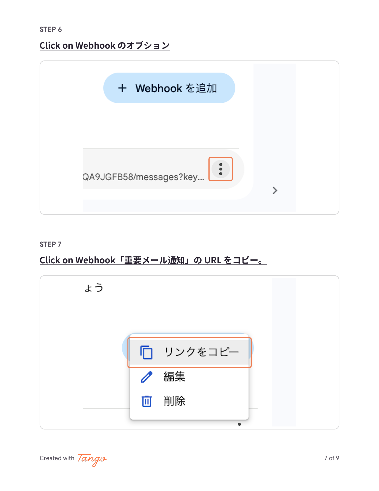

<!-- _class: lead -->

# Google Chat Webhook の追加方法

重要メール通知を Google Chat スペースに
自動送信するための Webhook 設定手順

---

### 1 「通知用」スペースをクリック

通知を受け取りたいスペースを開く

---

### 2 「アプリと統合」をクリック

スペースの設定メニューから「アプリと統合」を選択

---

### 3 「Webhook を追加」をクリック

---

### 4 名前に「重要メール通知」と入力

用途がわかる名前を付ける

---

### 5 「保存」をクリック

---

### 6 Webhook のオプションメニューを開く

保存した Webhook の右側にあるメニューアイコンをクリック

---

### 7 「URL をコピー」をクリック

コピーした URL を GAS やスクリプトに貼り付けて使用

---

### 活用のコツ

- **1スペース1用途** — 通知の種類ごとにスペースを分けると見やすい
- **Webhook URL は秘密情報** — 知っている人は誰でも投稿できるので漏洩注意
- **GAS と組み合わせ** — Gmail の重要メールを自動で Chat に転送できる

---

<!-- _class: lead -->

# これで Webhook 設定完了

コピーした URL を GAS や自動化ツールに
貼り付けて通知を飛ばしましょう
